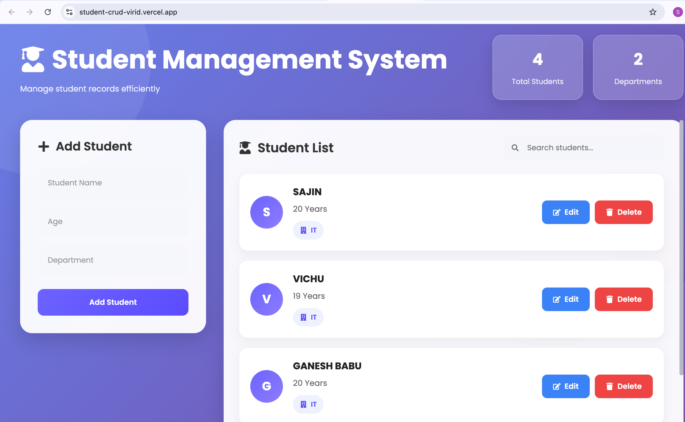
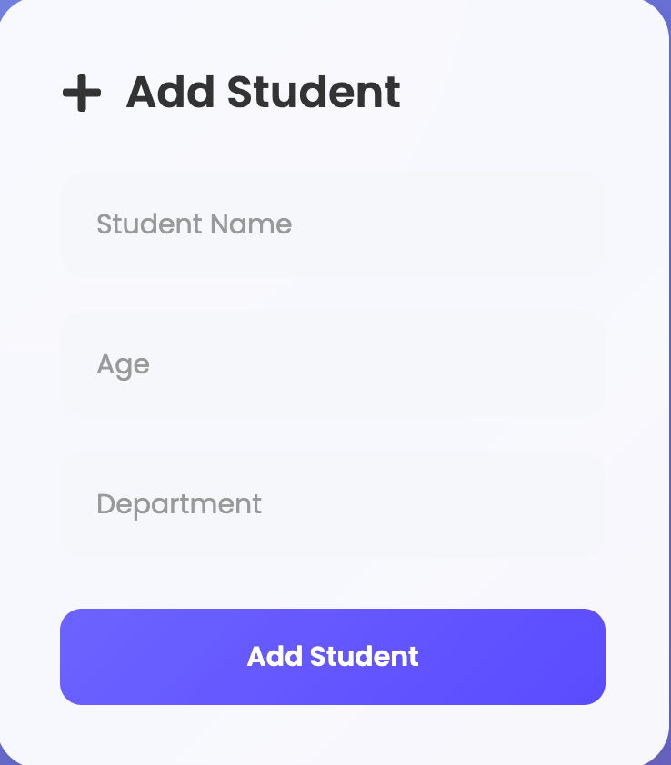
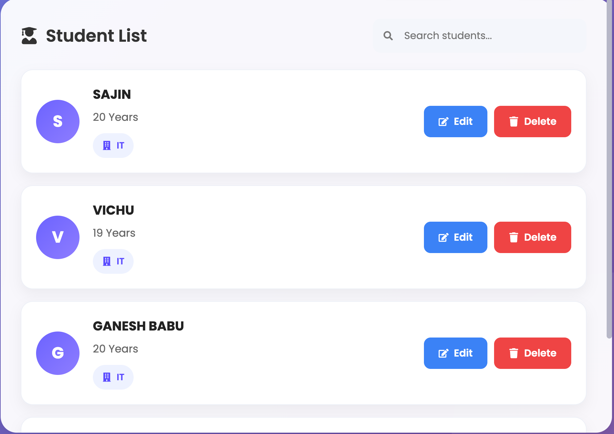
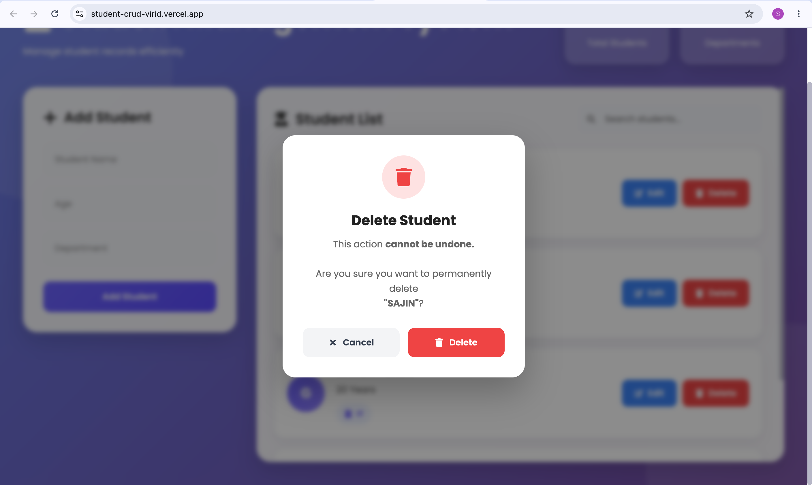

# 🎓 Student Management System
## 📖 Project Overview

The Student Management System is a full-stack CRUD web application that enables users to manage student records through a responsive React frontend and a Django REST Framework backend.

The project demonstrates REST API development, frontend-backend integration, deployment, and modern web development best practices.

A modern full-stack Student Management System built using **React.js** and **Django REST Framework**. The application allows users to manage student records with complete CRUD (Create, Read, Update, Delete) functionality through a clean and responsive user interface.

---


## 🌐 Live Demo

### 🌐 Frontend

👉 https://student-crud-virid.vercel.app/

### 🚀 Backend API

👉 https://sajins.pythonanywhere.com/api/students/

---

## 📸 Screenshots

### Home



### Add Student



### Student List



### Delete Confirmation



## Architecture

React (Frontend)
        │
        │ Axios
        ▼
Django REST API
        │
        ▼
SQLite Database

## ✨ Features

- ✅ Add new students
- ✅ View all students
- ✅ Update student details
- ✅ Delete students
- ✅ Search students instantly
- ✅ Responsive UI
- ✅ REST API integration
- ✅ Delete confirmation popup
- ✅ Live deployed application

---

## 🛠 Tech Stack

### Frontend

- React.js
- Vite
- Axios
- CSS3

### Backend

- Python
- Django
- Django REST Framework

### Database

- SQLite

### Deployment

- Vercel (Frontend)
- PythonAnywhere (Backend)

### Version Control

- Git
- GitHub

---
## 📊 Project Status

✅ Completed

✔ Full Stack

✔ Live Deployed

✔ Production Ready

## 📂 Project Structure

```
Student_crud/
│
├── backend/
│
├── students/
│
├── frontend/
│   ├── src/
│   ├── public/
│   └── package.json
│
├── manage.py
├── requirements.txt
└── README.md
```

---

## 🚀 API Endpoints

| Method | Endpoint | Description |
|--------|----------|-------------|
| GET | `/api/students/` | Get all students |
| POST | `/api/students/` | Create student |
| GET | `/api/students/<id>/` | Get one student |
| PUT | `/api/students/<id>/` | Update student |
| DELETE | `/api/students/<id>/` | Delete student |

---

## ⚙️ Installation

### Clone Repository

```bash
git clone https://github.com/sajins371-hue/Student-crud.git
cd Student-crud
```

---

### Backend Setup

```bash
python -m venv venv
```

Windows

```bash
venv\Scripts\activate
```

macOS/Linux

```bash
source venv/bin/activate
```

Install dependencies

```bash
pip install -r requirements.txt
```

Run migrations

```bash
python manage.py migrate
```

Start Django server

```bash
python manage.py runserver
```

---

### Frontend Setup

```bash
cd frontend
```

Install packages

```bash
npm install
```

Run development server

```bash
npm run dev
```

---

## 📌 Future Improvements

- User Authentication
- JWT Login
- Pagination
- Sorting
- Export to Excel
- Dashboard Analytics
- Dark Mode
- PostgreSQL Database

---

## 👨‍💻 About the Developer

**Sajin**

B.Tech Information Technology Student

- GitHub: https://github.com/sajins371-hue

GitHub:
https://github.com/sajins371-hue

---

## ⭐ If you like this project

Give this repository a ⭐ on GitHub!
